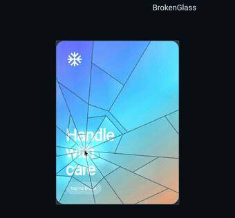
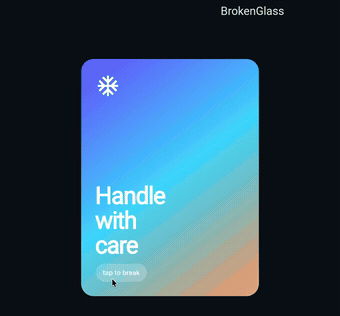

# broken_glass

Make any Flutter widget look like a pane of glass — then break it.

<p align="center">
  
</p>

`BrokenGlass` snapshots its child the instant it breaks, carves the snapshot
into shards along a radial fracture pattern, and tumbles the pieces away from
the point of impact. Every shard clips the *same* snapshot, so the artwork stays
continuous across the cracks: it reads as the widget itself breaking, not as a
crack decal laid on top. `restore()` plays the whole thing backwards.

## Usage

Wrap anything and flip a bool:

```dart
BrokenGlass(
  broken: _isBroken,
  impact: Alignment.center,
  child: Image.asset('assets/photo.jpg'),
)
```

Break wherever the user touches:

```dart
BrokenGlass(
  breakOnTap: true, // tap to break at that point, tap again to reassemble
  child: MyCard(),
)
```

Or drive it imperatively:

```dart
final glass = BrokenGlassController();

BrokenGlass(controller: glass, child: MyCard());

glass.shatter(alignment: Alignment.topLeft); // or shatter(at: localOffset)
glass.restore();                             // plays the break backwards
```

## Cracked, but not falling apart

`scatter: false` stops at damaged glass — the pieces stay put. Good as a
"broken screen" overlay. `ShatterPattern.chunky` breaks into a few big panes
instead of a spray of fragments.

<table>
  <tr>
    <td width="50%"></td>
    <td width="50%"></td>
  </tr>
  <tr>
    <td align="center"><code>scatter: false</code> · <code>ShatterPattern.spiderWeb</code></td>
    <td align="center"><code>ShatterPattern.chunky</code> · <code>GlassStyle.frost</code></td>
  </tr>
</table>

```dart
BrokenGlass(
  broken: true,
  scatter: false,
  pattern: ShatterPattern.spiderWeb,
  style: GlassStyle.screen,
  child: const MyScreen(),
)
```

## Tuning the break

`ShatterPattern` decides the *geometry*: `rays` cracks run out from the impact,
crossed by `rings` concentric fracture lines. Cells of that web become shards,
and neighbouring cells are randomly fused (`mergeChance`) so the pieces come out
in believably different sizes. `density` above `1` bunches the rings near the
impact, so the glass is pulverised where it was hit and holds together in large
panes at the edges.

```dart
ShatterPattern(rays: 13, rings: 5, angleJitter: 0.5, density: 1.75)
```

Presets: `ShatterPattern.fine`, `.chunky`, `.spiderWeb`.

`GlassStyle` decides the *look*: `crackColor` and `crackWidth` for the fracture
lines, `edgeColor` / `edgeOpacity` for the lit bevel that appears once a shard
lifts away, `glare` for the per-facet sheen, `tint` for the glass's own hue, and
`shadows` for shards casting onto what is behind them.

Presets: `GlassStyle.window`, `.screen`, `.frost`.

Motion is on the widget: `duration`, `spread` (how far pieces fly), `gravity`
(how far they fall), `rotation` (tumble), `fade`, and `curve`.

```dart
BrokenGlass(
  broken: true,
  duration: const Duration(milliseconds: 1600),
  spread: 140,
  gravity: 500,
  rotation: 1.4,
  seed: 42, // fixes the pattern; omit to break differently every time
  onShattered: () => debugPrint('gone'),
  child: child,
)
```

## How it works

1. The child lives inside a `RepaintBoundary` and is fully interactive.
2. On break, `toImageSync` grabs the boundary in the same frame — no flicker,
   no async gap.
3. `ShatterPattern` builds a shared vertex grid in polar coordinates around the
   impact, forms cells from it, and clips each cell to the widget's bounds with
   Sutherland–Hodgman. Because neighbouring cells share vertices, the shards
   tile the surface exactly — no seams, no overlap (there is a test for this).
4. A single `CustomPainter` draws every shard: transform, clip, blit the
   snapshot, then sheen and edges. One image, one layer, one draw pass per
   shard.
5. While broken, the child is kept in the tree with `Visibility` so it keeps its
   layout and state but is not painted or hit-tested. `restore()` reverses the
   animation and hands the child back.

## Notes and limits

- Once broken, the child is a frozen image. Pause videos or animations
  underneath if the glass stays broken.
- Snapshotting needs Impeller, Skia or CanvasKit. It does not work on Flutter
  web's legacy HTML renderer.
- Widgets inside the child that handle taps themselves win the gesture over
  `breakOnTap`; use a `BrokenGlassController` for interactive children.
- Cost scales with shard count (`rays × rings`). The defaults produce ~50
  shards, which is comfortable; `ShatterPattern.fine` produces ~170.

## Example

```sh
cd example && flutter run
```

A live playground — the one in the GIFs above. Tap the card to break it where
you touch, and switch pattern, style, spread and gravity while it is broken.

## License

MIT
